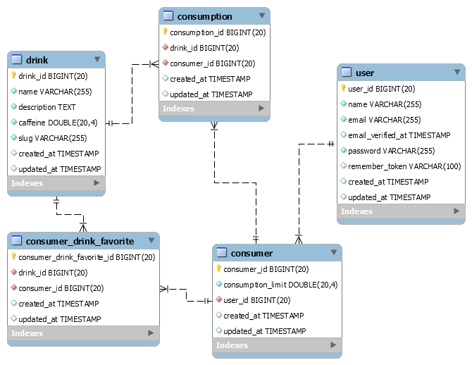

# Laravel Study Cafe REST API using JWT Auth

Hi! It's my study about Laravel 7 using Docker (Compose file version 3.5) 

 - [x] MySQL 5.7 
 - [x] PHP 7.2 
 - [x] Apache 2.4.38  
 - [x] Debian 10.4
 
# EDR

# Collection Documentation POSTMAN
https://documenter.getpostman.com/view/12253802/T1DwbZ7d
  
# Commands to execute outside Docker
`docker-compose build`

`docker-compose up -d`

`docker exec -it cafe-app bash -c "sudo -u devuser /bin/bash" `

# Commands to execute inside of Docker
`composer install`

`php artisan migrate:install`

`php artisan migrate`

 - Creating first user using Tinker
 
`php artisan tinker`

`$user = new \App\User();`

`$user->name = "Gustavo";`

`$user->email = 'gustavo@caffe.com';`

`$user->password = bcrypt('12356');`

`$user->save();`

`exit()`

# Steps and Tests
[Download File](steps_and_tests.pdf)
